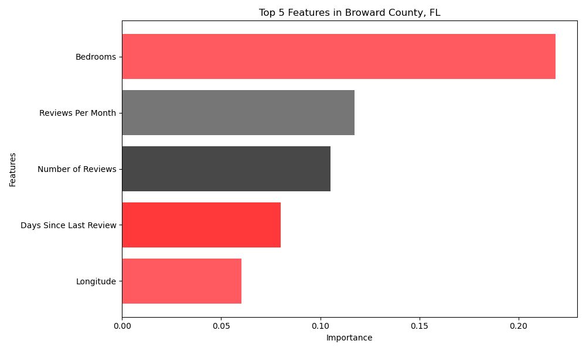

# Airbnb-Price-Predictions-Florida-Edition

## Problem Statement

The "Airbnb Price Predictions Florida Edition" is a data science project aimed at predicting the daily prices of Airbnb listings in Florida. With the increasing popularity of Airbnb as an alternative to traditional accommodation options, understanding and predicting the factors that influence daily listing prices is essential for both hosts and travelers. By leveraging machine learning techniques and analyzing various features of Airbnb listings, this project seeks to develop accurate price prediction models that can provide valuable insights to hosts for setting competitive prices and help travelers make informed decisions when booking accommodations. The project aims to uncover the key drivers of Airbnb prices in Florida, including location, property type, amenities, availability, and other relevant factors, ultimately enabling stakeholders to optimize their pricing strategies and enhance the overall Airbnb experience for both hosts and travelers.

## Notebooks

The project consists of three Jupyter notebooks:

1. [EDA/Cleaning](notebooks/EDA_Cleaning.ipynb): This notebook performs exploratory data analysis and data cleaning tasks. It covers loading the raw dataset, examining its structure and statistics, handling missing values, cleaning the data, and conducting exploratory data analysis.

2. [Feature Engineering](notebooks/Feature_Engineering.ipynb): In this notebook, feature engineering tasks are performed to prepare the data for modeling. It includes preprocessing text data, creating new features based on descriptions and temporal patterns, handling missing values, and exploring top amenities.

3. [Modeling](notebooks/Modeling.ipynb): The modeling notebook focuses on building predictive models for Airbnb prices. It covers loading the preprocessed data, conducting a baseline prediction, training a Gradient Boosting model and a LassoCV model, making predictions, and evaluating the model's performance.

## Key Findings

Here are some key findings from the project:

- The exploratory data analysis revealed interesting insights about the dataset, such as the distribution of room types and neighborhoods, as well as the correlation between variables.
- Feature engineering tasks, including text preprocessing, temporal feature extraction, and handling missing values, enhanced the dataset and provided valuable information for modeling.
- The Gradient Boosting model demonstrated strong performance in predicting Airbnb prices, with a low mean squared error (MSE) and mean absolute error (MAE).

## Modeling Choices

In the Modeling notebook, four models were trained to predict Airbnb prices: Linear Regression, RidgeCV, Gradient Boosting, and LassoCV. These models were chosen for their suitability in regression tasks and their ability to capture different types of relationships between features and the target variable.

1. Linear regression is a simple and interpretable model that assumes a linear relationship between the features and the target variable.

2. Gradient Boosting is an ensemble model that combines multiple weak predictors (decision trees) to create a strong predictive model. It sequentially builds the model, with each new tree learning from the errors of the previous trees. Gradient Boosting is known for its ability to handle complex relationships and provide high predictive accuracy.

3. LassoCV is a linear regression model that performs both feature selection and regularization. It applies L1 regularization to shrink the coefficients of irrelevant features to zero, effectively selecting the most relevant features for prediction. LassoCV helps improve model interpretability and can handle high-dimensional datasets.

4. RidgeCV is a linear regression model with built-in cross-validation to determine the optimal regularization parameter (alpha). It helps to mitigate multicollinearity issues and can handle a large number of features.

The evaluation metrics used to assess the performance of the models were mean squared error (MSE), root mean squared error (RMSE), mean absolute error (MAE), and R-squared (R^2). These metrics provide insights into the accuracy, precision, and goodness of fit of the price predictions.

## Model Evaluation

The performance of the different models in predicting Airbnb prices in Florida is summarized below:
| Model              | RMSE     | R^2      | MSE     | MAE      |
|--------------------|----------|----------|---------|----------|
| Baseline           | 0.9173   | -        | -       | 0.4673   |
| Linear Regression  | 570.72   | -3.55e+23 | 3.26e+23 | 35.84e+09 |
| Gradient Boosting  | 0.7210   | 0.4333   | 0.5198  | 0.2619   |
| LassoCV            | 0.8088   | 0.2869   | 0.6542  | 0.3183   |
| RidgeCV            | 0.8093   | 0.2869   | 0.6549  | 0.3225   |

The Gradient Boosting model outperformed the other models, achieving the lowest MSE and MAE scores. This indicates that it provides more accurate predictions of daily Airbnb prices in Florida.

## Conclusion
The dataset contains information about Airbnb listings in Florida, including various features such as the number of bedrooms, reviews per month, and the number of reviews. The analysis revealed that "Bedrooms," "Reviews Per Month," and "Number of Reviews" are among the top features that significantly impact the prediction of Airbnb prices in the given model. These variables showcase their importance in determining the pricing dynamics in the Florida Airbnb market.

After evaluating different regression models, including LassoCV, RidgeCV, and Gradient Boosting, we determined that the Gradient Boosting model performed the best, providing the most accurate predictions. The other models, LassoCV and RidgeCV, also performed reasonably well but were slightly less accurate. However, the basic Linear Regression model did not perform well at all. These results indicate that the Gradient Boosting model is the most reliable for making predictions in this scenario. Its ability to capture complex interactions between variables and handle non-linear relationships makes it well-suited for accurately predicting Airbnb prices in Florida.

## Dataset

The dataset used in this project is based on the "listings-3.csv" file, which contains Airbnb listings in Broward County, Florida. The dataset was cleaned and preprocessed as part of the project.

You can access the dataset [here](http://insideairbnb.com/get-the-data/).

## Data Dictionary
For detailed information about the variables used in the project, please refer to the [Data Dictionary](https://docs.google.com/spreadsheets/d/1iWCNJcSutYqpULSQHlNyGInUvHg2BoUGoNRIGa6Szc4/edit#gid=1322284596) provided in a Google Sheets document.

The data dictionary below provides a description of the variables used in the project:

| Variable                              | Description                                                          | Data Type       |
| ------------------------------------- | -------------------------------------------------------------------- | --------------- |
| `listings_cleaned`                    | The cleaned dataset containing Airbnb listing data.                   | DataFrame       |
| `listings_cleaned['description_length']`| The length of the description for each listing.                       | Numeric (integer) |
| `listings_cleaned['last_review']`      | The date of the last review for each listing.                         | Date            |
| `listings_cleaned['last_review_month']`| The month of the last review for each listing.                        | Numeric (integer) |
| `listings_cleaned['has_host']`         | Binary indicator for whether a listing has a host or not.             | Numeric (integer) |
| `listings_cleaned['is_popular_neighborhood']` | Binary indicator for whether a listing is located in a popular neighborhood. | Numeric (integer) |
| `amenities_to_extract`                 | List of specific amenities to extract from the `amenities` column.    | List            |
| `listings_cleaned[amenity]`            | Binary indicator for the presence of a specific amenity in a listing. | Numeric (integer) |
| `listings_cleaned['total_amenities']`  | Total number of amenities for each listing.                           | Numeric (integer) |
| `textual_columns`                      | List of textual columns to apply preprocessing.                       | List            |
| `listings_cleaned[column]`             | Preprocessed textual column.                                          | Text/String     |
| `processed_text`                       | Processed text after applying preprocessing steps.                    | Text/String     |
| `listings_cleaned['name_length']`       | The length of the name of each listing.                               | Numeric (integer) |
| `listings_cleaned['description_sentiment']` | Sentiment score of the description for each listing.                | Numeric (float) |
| `listings_cleaned['has_reviews']`       | Binary indicator for whether a listing has reviews.                   | Numeric (integer) |
| `listings_cleaned['days_since_last_review']` | Number of days since the last review for each listing.             | Numeric (integer) |
| `numeric_features`                     | DataFrame containing numeric features for scaling.                    | DataFrame       |
| `categorical_features`                 | DataFrame containing categorical features for encoding.               | DataFrame       |
| `scaled_df`                            | DataFrame containing scaled numeric features.                         | DataFrame       |
| `encoded_df`                           | DataFrame containing encoded categorical features.                    | DataFrame       |
| `combined_df`                          | DataFrame containing scaled and encoded features.                      | DataFrame       |

## License

This project is licensed under the [MIT License](LICENSE).
